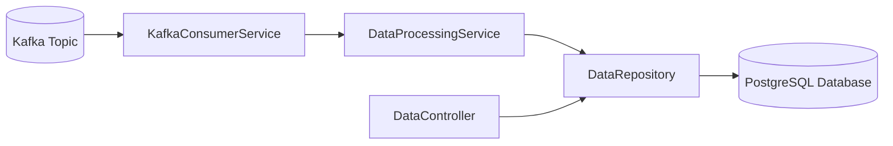
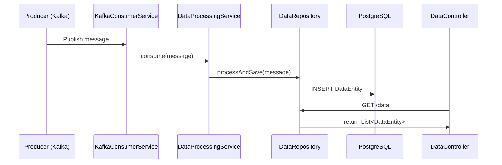

# 📌 Data Pipeline Project

## 📖 Overview
This project is a **simple data pipeline** built with **Quarkus, PostgreSQL, and Apache Kafka**.  
It demonstrates how incoming messages from Kafka are **processed**, **persisted** into the database, and **exposed via a REST API**.

The project follows a **modular clean architecture**:

- 📨 **Consumer** → Listens to Kafka topic  
- ⚙️ **Service** → Processes messages  
- 💾 **Repository** → Handles persistence  
- 🌐 **Controller** → REST API for accessing data  

---

## 🏗️ System Design

### 🖼️ Architecture Diagram


### 🔄 Sequence Diagram


---

## 📂 Project Structure
```
quarkus-kafka-data-pipeline/
 ┣ src/main/java/com/example/pipeline/
 ┃ ┣ controller/       # REST API Layer
 ┃ ┣ consumer/         # Kafka Consumer
 ┃ ┣ model/            # JPA Entities
 ┃ ┣ repository/       # Panache Repository
 ┃ ┗ service/          # Business Logic
 ┣ src/test/java/com/example/pipeline/
 ┃ ┗ DataPipelineTest.java
 ┣ src/main/resources/
 ┃ ┗ application.properties
 ┗ README.md
```

---

## ⚡ API Documentation

### 1️⃣ Get All Data  
**Endpoint:** `GET /data`  
**Description:** Retrieves all data from database.  

📥 **Response Example**:
```json
[
  {
    "id": 1,
    "name": "KafkaMessage",
    "value": 123456789
  }
]
```

---

### 2️⃣ Create Data  
**Endpoint:** `POST /data`  
**Description:** Creates a new DataEntity entry.  

📤 **Request Example**:
```json
{
  "name": "ManualEntry",
  "value": 42
}
```

📥 **Response Example**:
```json
{
  "id": 2,
  "name": "ManualEntry",
  "value": 42
}
```

---

## ▶️ Running the Project

### 1. Start PostgreSQL
Make sure PostgreSQL is running and configured in `application.properties`:

```properties
quarkus.datasource.db-kind=postgresql
quarkus.datasource.username=postgres
quarkus.datasource.password=postgres
quarkus.datasource.jdbc.url=jdbc:postgresql://localhost:5432/pipeline
quarkus.hibernate-orm.database.generation=update
```

### 2. Start Kafka (Local)
- ✅ If using **Dev Services (Quarkus)** → Kafka will run automatically in dev mode.  
- ⚡ Or manually start **Kafka + Zookeeper** (e.g., via Docker).

### 3. Run Application
```bash
mvn quarkus:dev
```

### 4. Access API
Open in browser: [http://localhost:8080/data](http://localhost:8080/data)

---

## ✅ Testing

Run unit tests:
```bash
mvn test
```

Example: **DataPipelineTest.java**
- Saves a test message using `DataProcessingService`
- Verifies it was persisted correctly in the database  

---

## 🚀 Features
- 📨 Kafka consumer integrated with **Quarkus Reactive Messaging**  
- 💾 PostgreSQL persistence with **Panache ORM**  
- 🌐 REST API for data access  
- 🧪 Unit test with **QuarkusTest**  

---

## 📌 Next Steps
- 🔗 Add integration test for Kafka consumer  
- 🐳 Add `docker-compose` for easier local setup (**Kafka + Postgres**)  
- ⚠️ Implement error handling & retries  